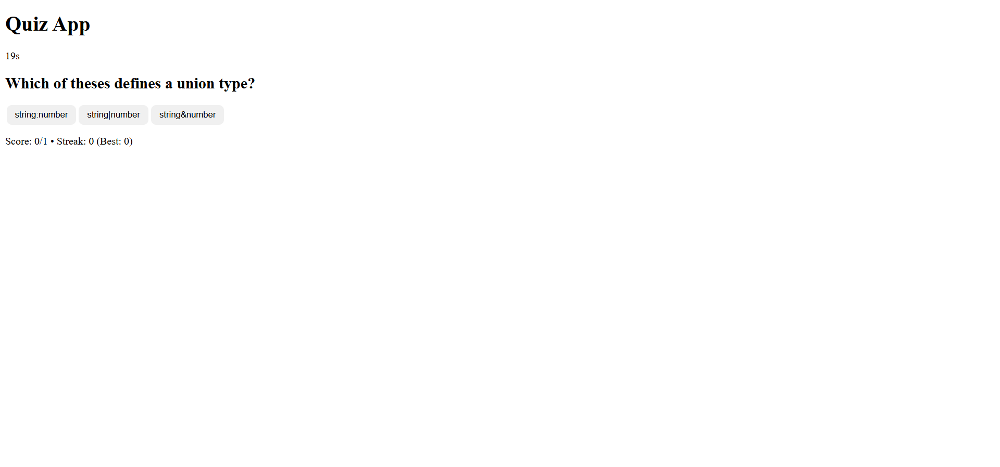

# TypeScript Quiz App

A mini quiz app built with **TypeScript** to practice generics, discriminated unions, and DOM manipulation.

[](https://conorgregson.github.io/ts-quiz-app)


---

### Tech Stack Overview

#### Core


#### APIs & Tools


---

## Live Demo

**▶ Try it now:** https://conorgregson.github.io/ts-quiz-app

> Data is saved locally in your browser via `localStorage`

---

## About

A browser-based quiz built with **TypeScript + DOM**, designed as a learning project to practice strong typing, DOM manipulation, and clean app architecture.

The quiz supports **multiple-choice and true/false questions**, timers per question, streak tracking, and a full review summary with explanations.

---

## Features

- **Multiple question types:** text-based and true/false
- **Timed questions:** countdown timer with timeout handling
- **Score tracking:** correct answers, total, current streak, best streak
- **Review missed section:** shows each missed question, your answer, correct answer, and explanation
- **LocalStorage persistence:** saves your best score and best streak across sessions
- **Pause / Resume timer:** with overlay and sound cues
- **Sound effects:** for correct, incorrect, timeout, pause, and resume actions
- **Mute + volume control**
- **Restart Quiz / Reset All Progress buttons**
- **Keyboard shortcuts:**
  - **Space** — Resume quiz when paused
  - **C** — Toggle clean UI (hide toolbar)

---

## Controls

| Action                 | Description                                                |
| ---------------------- | ---------------------------------------------------------- |
| **Answer click**       | Selects an option                                          |
| **Timer ends**         | Counts as missed question with “(no answer)”               |
| **Pause / Resume**     | Toggles timer and overlay                                  |
| **Restart Quiz**       | Restarts this run only                                     |
| **Reset All Progress** | Clears saved best score and streak (confirmation required) |
| **Space**              | Resume when paused                                         |
| **C**                  | Toggle clean UI mode                                       |

---

## Tech Stack

- **TypeScript** (strict mode enabled)
- **HTML5** and **CSS3**
- **LocalStorage API** (save best scores)
- **Web Audio API** (sound effects)
- **ES Modules** (browser-native imports)
- Compiled to **JavaScript** using `tsc -w`

---

## Project Structure

```bash
ts-quiz-app/
│
├── src/                            # TypeScript source files
│   ├── main.ts                     # Main orchestrator (UI logic)
│   ├── engine.ts                   # Core quiz logic (timer, scoring, streaks)
│   ├── enums.ts                    # Enum definitions (QuestionKind, etc.)
│   ├── questions.ts                # Question data
│   ├── sound.ts                    # Web Audio API sound effects
│   ├── utils.ts                    # Utility helpers (shuffle, LocalStorage)
│   └── types.ts                    # Shared TypeScript interfaces & types
│
├── build/
│   └── js/                         # Compiled JavaScript output
│       ├── main.js
│       ├── engine.js
│       ├── enums.js
│       ├── questions.js
│       ├── sound.js
│       ├── utils.js
│       └── types.js
│
├── images/                         # Screenshots
│   ├── quiz-running.png
│   ├── quiz-paused.png
│   ├── quiz-summary.png
│   └── quiz-clean-ui.png
│
├── index.html                      # Main HTML file
├── styles.css                      # Project styling (UI + controls)
├── tsconfig.json                   # TypeScript configuration
├── README.md                       # Project documentation
├── LICENSE.md                      # License documentation
├── .gitignore                      # Git ignore rules
└── .gitattributes                  # Text normalization (optional)
```

- **main.ts** – Orchestrates the app and handles DOM updates
- **engine.ts** – Core game logic (scoring, timer, streak, pause/resume, timeout handling)
- **sound.ts** – Generates audio cues with the Web Audio API
- **utils.ts** – Helper functions (shuffle, best score storage)
- **questions.ts** – Question bank
- **types.ts / enums.ts** – TypeScript definitions for strong typing
- **index.html / styles** – UI layout and minimal styling

---

## Screenshots

### Quiz Running

Displays the current question, answer options, countdown timer, and score tracker.


### Paused State

Overlay with “⏸ Paused” message, dimmed question area, and resume controls.


### Review Summary

Shows your final score, best streaks, and a detailed “Review Missed” list with explanations.


### Clean UI Mode

Hides the toolbar for a minimal, distraction-free quiz experience.



---

## Learning Focus

This mini-project helped me practice:

- **TypeScript** generics and discriminated unions
- Work with browser **DOM APIs** using strict types
- Manage state cleanly via a lean orchestrator (`main.ts`)
- Add polish through **UX features** like sound, pause overlay, and persistent scoring

---

## Getting Started

1. **Clone the repository**

```bash
git clone https://github.com/your-username/ts-quiz-app.git
cd ts-quiz-app
```

2. **Compile the TypeScript files**

```bash
tsc --watch
```

3. **Start a local server**

- Open `index.html` in your browser or launch with Live Server in VS Code.

4. **Play the Quiz!**

---

## Known Limitations and Future Improvements

This project was designed as a learning exercise, so a few features were intentionally simplified. Below are potential enhancements for future versions:

- Question categorization & difficulty levels:
  - Allow filtering or progressive difficulty
- Progress indicator or animated transitions:
  - Smoother UX between questions
- External JSON question import:
  - Dynamically load new question sets
- Leaderboard & stats tracking:
  - Using `localStorage` or simple web sharing
- Responsive layout adjustments:
  - Improved mobile scaling and spacing
- Sound theme selector:
  - Toggle between “Arcade”, “Subtle UI”, and “Sci-Fi” sound profiles

---

## Author

Made by Conor Gregson

- [GitHub](https://github.com/conorgregson)
- [LinkedIn](https://www.linkedin.com/in/conorgregson)

---

## License

This project is open-source and available under the **MIT License**. See the [LICENSE](LICENSE.md) file for details.
